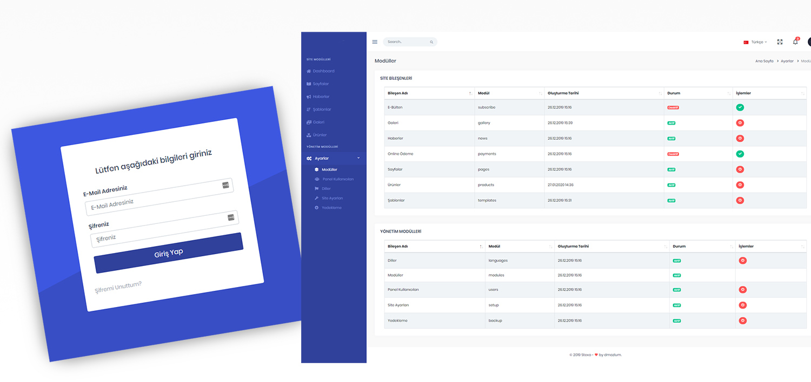

# Larevel CMS Panel

This is an open source of Content Management System developed with [Laravel](http://laravel.com/) framework.

## Installing dependencies

[PHP](https://php.net) 5.5+, a database server, and [Composer](https://getcomposer.org) are required.

To install the defined dependencies for your project, run the install command.

Use Composer : `php composer install`

Admin Panel URL : (http://localhost/cms/Admin)
Admin User : test@test.com
Password   : test

## License

The Larevel CMS Panel is open-sourced software licensed under the [MIT license](http://opensource.org/licenses/MIT).

## Support

### Show some :heart: and star the repo to support the project
